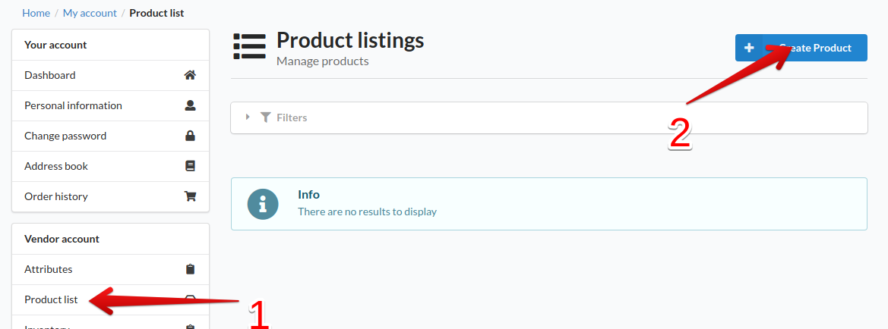
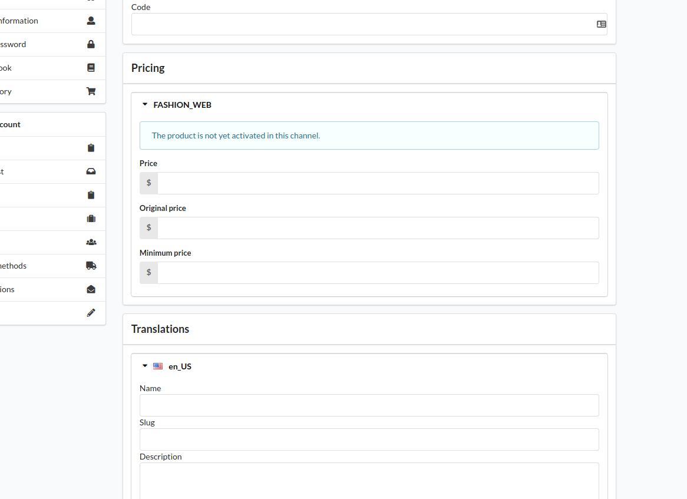
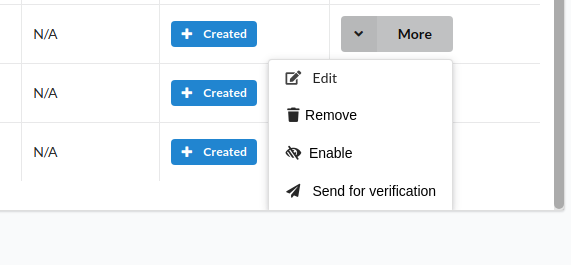
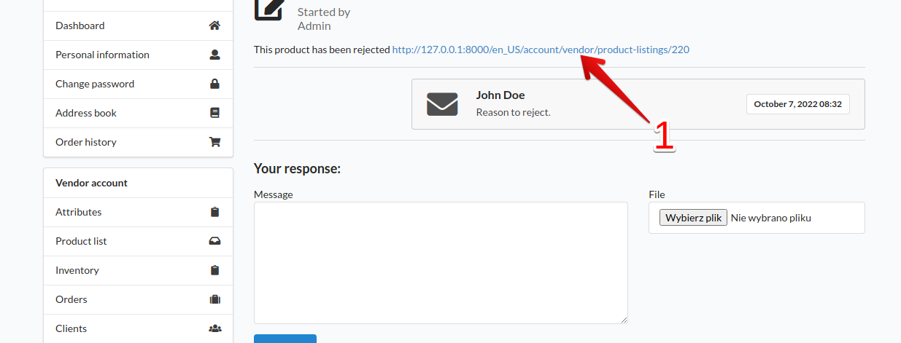
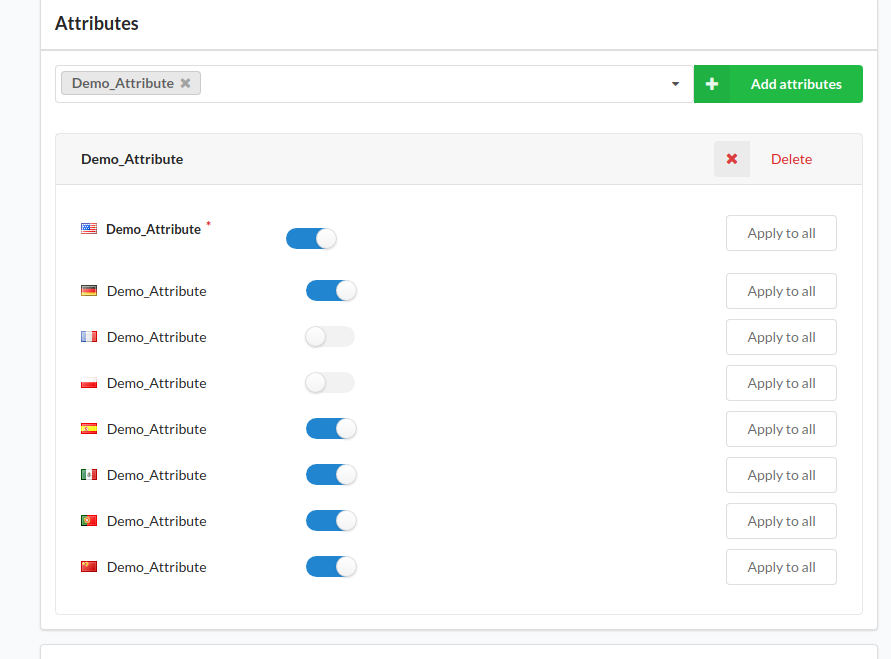

## Product listing creation

Registered vendor can create product listing by visiting 
Product listings page (1).
And click create product button (2).

Then vendor user have to fill up product listing form.

In order to add attribute to product vendor have to 
[create attribute](#adding-attributes) first.

After saving form, vendor can edit it or send to verification by application
administrator. After sending for verification editing product is blocked.

Then it is up to the admin to decide whether the product list is rejected or
the product becomes available to the customer in the market, the admin can view
list of products sent for verification in the administration panel via the product listings tab (1). Each product listing has a detail page
where admin can view product details and decide whether or not to accept (2).

## Product listing verification

1. ### Rejecting product
    If administrator decide to reject product, message containing
    information why product was rejected is sent to vendor, also status
    of product listing is set to rejected.
    
    
    
    Vendor can discuss this reason, or edit product and send for verification
    updated product listing.

2. ### Accepting product
    If administrator accepts product listing it become converted to product
    available for customers.

## Product listing versioning

Any changes made after accepting product have to be accepted by
administrator once again.

## Adding attributes

In order to add attribute to product listing vendor have to create it 
first, by filling form (1) available from attributes management page (2).

Then every attribute created by vendor can be added to product listing. 

